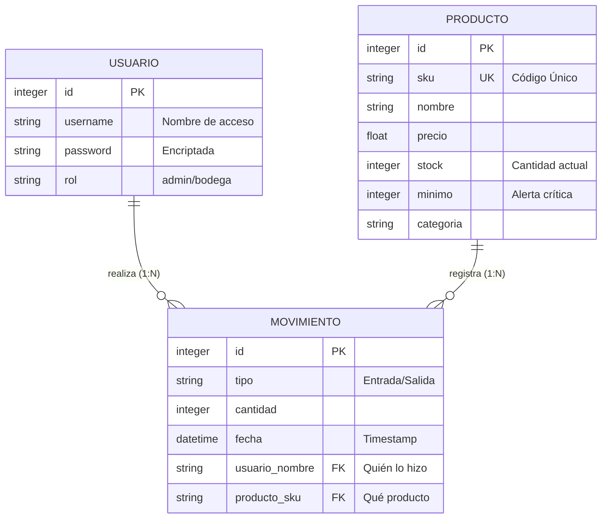
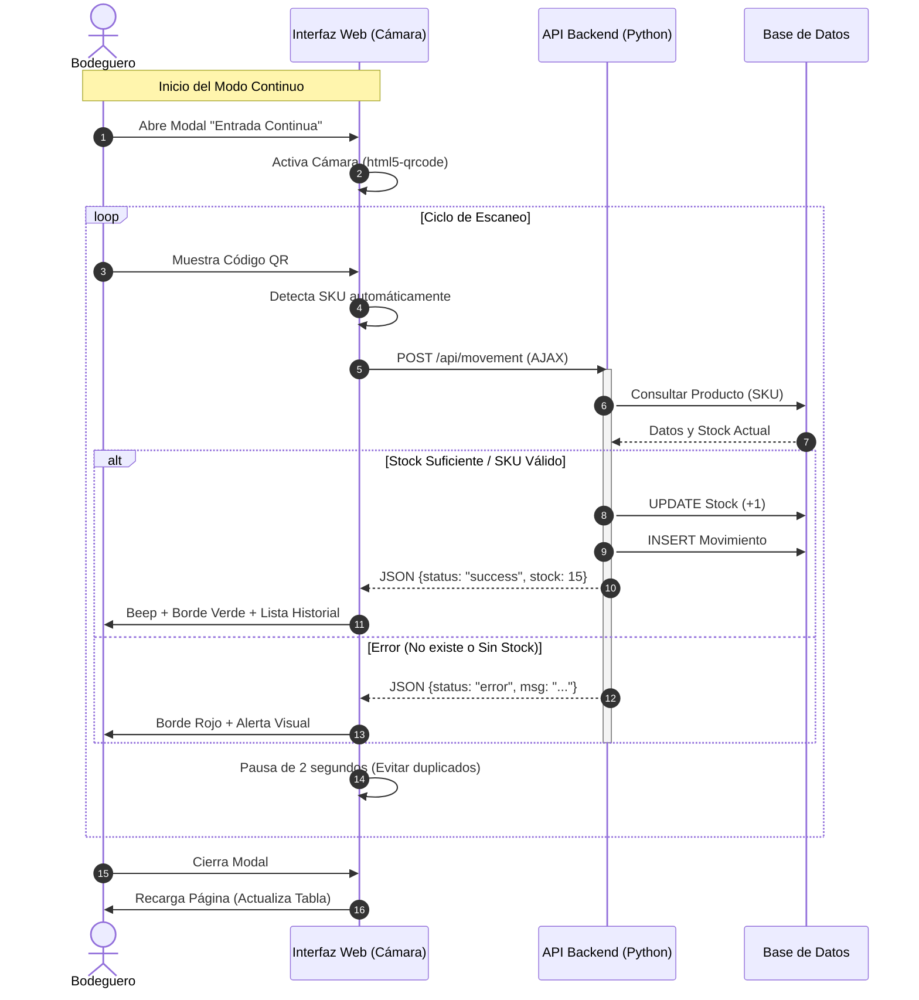

# Sistema de Gestión de Inventario Inteligente (Scan & Go)

### 📋 Descripción
Plataforma web desarrollada para optimizar la gestión logística de PYMEs. Permite el control de inventario en tiempo real y automatiza la entrada/salida de productos utilizando la cámara de dispositivos móviles como lector de códigos QR/Barras, eliminando la necesidad de hardware dedicado.

### 🚀 Características Principales
- Modo Kiosco (Scan & Go): Registro continuo de movimientos sin recargar la página (AJAX).
- Gestión de Stock: CRUD completo de productos con alertas de stock crítico.
- Accesibilidad Móvil: Interfaz responsiva (Bootstrap 5) apta para smartphones.
- Seguridad: Sistema de autenticación y roles.
- Dashboard: KPIs y estadísticas de valorización en tiempo real.

### 🛠️ Tecnologías Utilizadas
- Backend: Python 3, Flask.
- Base de Datos: SQLite (Nativa).
- Frontend: HTML5, Jinja2, Bootstrap 5.
- JavaScript: Fetch API, Html5-Qrcode.

### ⚙️ Instalación y Ejecución
- Clonar el repositorio:
```bash
  git clone https://github.com/alexiisbc/sistema-inventario-qr.git
```
- Instalar dependencias:
```bash
  pip install -r requirements.txt
```
- Ejecutar la aplicación:
```bash
  python app.py
```
- Acceso:
  - Web: http://localhost:5000
  - Móvil: Usar Ngrok para crear un túnel HTTPS.
    - Comando: ngrok http 5000
    - Usar URL generada.
    - Nota Importante: Los navegadores modernos, tanto en PC como en Móvil, bloquean el acceso a la cámara si el sitio no es seguro (HTTPS). Si se intenta acceder usando la IP Local, la cámara no abrirá.  
  - Credenciales Demo: Usuario: admin / Contraseña: 1234

 ### Diagramas UML




### Autor
Manuel Alexis Becerra Cruz - Programación y Análisis de Sistemas
