# Sistema de Gestión de Inventario Inteligente (Scan & Go)

### 📋 Descripción
Plataforma web desarrollada para optimizar la gestión logística de PYMEs. Permite el control de inventario en tiempo real y automatiza la entrada/salida de productos utilizando la cámara de dispositivos móviles como lector de códigos QR/Barras, eliminando la necesidad de hardware dedicado.

### 🚀 Características Principales
- Modo Kiosco (Scan & Go): Registro continuo de movimientos sin recargar la página (AJAX).
- Gestión de Stock: CRUD completo de productos con alertas de stock crítico.
- Accesibilidad Móvil: Interfaz responsiva (Bootstrap 5) apta para smartphones.
- Seguridad: Sistema de autenticación y roles.
- Dashboard: KPIs y estadísticas de valorización en tiempo real.

### 🛠️ Tecnologías Utilizadas
- Backend: Python 3, Flask.
- Base de Datos: SQLite (Nativa).
- Frontend: HTML5, Jinja2, Bootstrap 5.
- JavaScript: Fetch API, Html5-Qrcode.

### ⚙️ Instalación y Ejecución
- Clonar el repositorio:
```bash
  git clone https://github.com/alexiisbc/sistema-inventario-qr.git
```
- Instalar dependencias:
```bash
  pip install -r requirements.txt
```
- Ejecutar la aplicación:
```bash
  python app.py
```
- Acceso:
  - Web: http://localhost:5000
  - Móvil: Usar Ngrok o IP local
  - Credenciales Demo: Usuario: admin / Contraseña: 1234

 ### Diagramas UML

```mermaid
erDiagram
    USUARIO ||--o{ MOVIMIENTO : "realiza (1:N)"
    PRODUCTO ||--o{ MOVIMIENTO : "registra (1:N)"

    USUARIO {
        integer id PK
        string username "Nombre de acceso"
        string password "Encriptada"
        string rol "admin/bodega"
    }

    PRODUCTO {
        integer id PK
        string sku UK "Código Único"
        string nombre
        float precio
        integer stock "Cantidad actual"
        integer minimo "Alerta crítica"
        string categoria
    }

    MOVIMIENTO {
        integer id PK
        string tipo "Entrada/Salida"
        integer cantidad
        datetime fecha "Timestamp"
        string usuario_nombre FK "Quién lo hizo"
        string producto_sku FK "Qué producto"
    }
```

```mermaid
sequenceDiagram
    autonumber
    actor Bodeguero
    participant Frontend as Interfaz Web (Cámara)
    participant API as API Backend (Python)
    participant BD as Base de Datos

    Note over Bodeguero, Frontend: Inicio del Modo Continuo
    Bodeguero->>Frontend: Abre Modal "Entrada Continua"
    Frontend->>Frontend: Activa Cámara (html5-qrcode)
    
    loop Ciclo de Escaneo
        Bodeguero->>Frontend: Muestra Código QR
        Frontend->>Frontend: Detecta SKU automáticamente
        Frontend->>API: POST /api/movement (AJAX)
        
        activate API
        API->>BD: Consultar Producto (SKU)
        BD-->>API: Datos y Stock Actual
        
        alt Stock Suficiente / SKU Válido
            API->>BD: UPDATE Stock (+1)
            API->>BD: INSERT Movimiento
            API-->>Frontend: JSON {status: "success", stock: 15}
            Frontend->>Bodeguero: Beep + Borde Verde + Lista Historial
        else Error (No existe o Sin Stock)
            API-->>Frontend: JSON {status: "error", msg: "..."}
            Frontend->>Bodeguero: Borde Rojo + Alerta Visual
        end
        deactivate API
        
        Frontend->>Frontend: Pausa de 2 segundos (Evitar duplicados)
    end

    Bodeguero->>Frontend: Cierra Modal
    Frontend->>Bodeguero: Recarga Página (Actualiza Tabla)
```




### 👤 Autor
Manuel Alexis Becerra Cruz - Programación y Análisis de Sistemas
